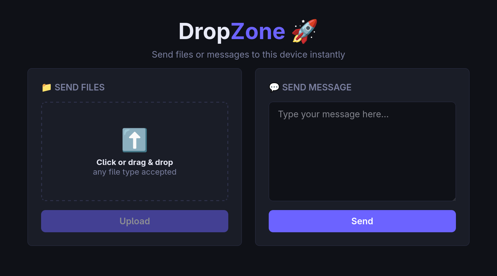

# DropZone 🚀

A minimal local-network file & message sharing CLI tool written in Rust.



### Features

- 📁 **File uploads** – connected devices can drag and drop or select files
- 💬 **Text messages** – typed messages are printed directly to your terminal
- 🌐 **Zero config** – just run the program and share the URL shown in the terminal
- 🎨 **Nice UI** – dark-themed web page, works on mobile too

### Build & Run

```bash
# clone / copy the project, then:
cargo build --release

# run on the default port 8080
./target/release/dropzone

# or specify a custom port
./target/release/dropzone 5050
```

## Configuration

1. By default, DropZone runs with TLS (HTTPS) using the certificate and private key specified in the environment variables `DROPZONE_CERT_PATH` and `DROPZONE_CERT_KEY_PATH`. To run without TLS (HTTP only), specify the `--no-tls` flag when running the command:
    ```bash
    # run on the default port 8080 without TLS
    ./target/release/dropzone --no-tls

    # run on the custom port without TLS
    ./target/release/dropzone 5050 --no-tls
    ```
2. On any device on the same network, open the **Network** URL, you may need to proceed to the site if using custom TLS certificate.
3. Upload files or type a message – files are saved to `./dropzone-uploads/` directory, messages are printed in the terminal.
