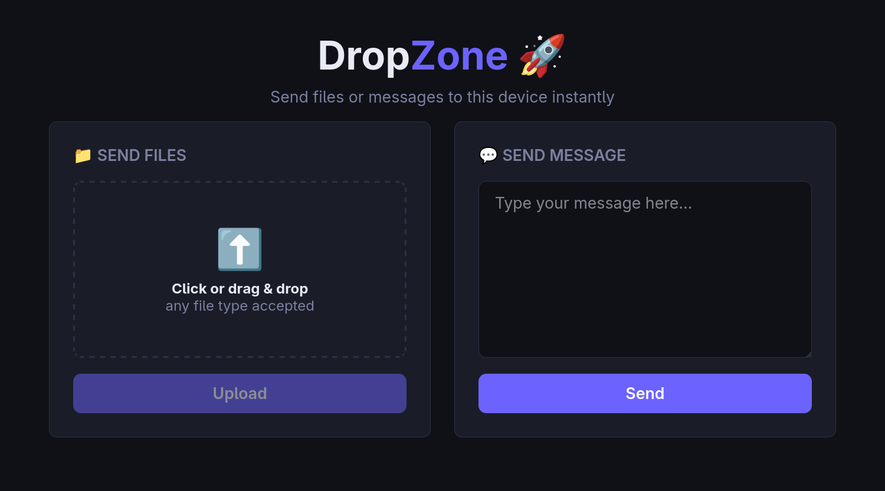

# DropZone 🚀

A minimal local-network file & message sharing CLI tool written in Rust.

<!-- 900x500 -->


### Features

- 📁 **File uploads** – connected devices can drag and drop or select files
- 💬 **Text messages** – typed messages are printed directly to your terminal
- 🌐 **Zero config** – just run the program and share the URL shown in the terminal
- 🎨 **Nice UI** – dark-themed web page, works on mobile too

### Build & Run

```bash
# clone / copy the project, then:
cargo build --release

# run on the default port 8080
./target/release/dropzone

# or specify a custom port
./target/release/dropzone 5050
```

### Configuration

1. By default, DropZone runs with TLS (HTTPS mode) using the certificate and private key specified in the environment variables `DROPZONE_CERT_PATH` and `DROPZONE_CERT_KEY_PATH`. To run without TLS (HTTP-only mode), use the `--no-tls` flag.
2. To show all available options, use the `--help` flag.
